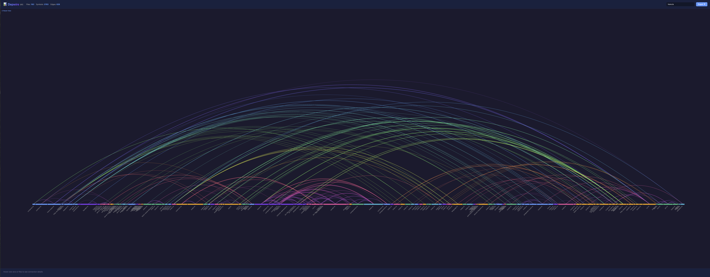
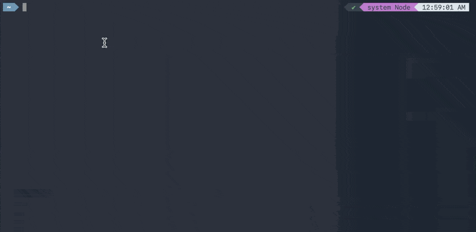

# Depwire



**See how your code connects. Give AI tools full codebase context.**

Depwire analyzes codebases to build a cross-reference graph showing how every file, function, and import connects. It provides:

- 🎨 **Beautiful arc diagram visualization** — Interactive Harrison Bible-style graphic
- 🤖 **MCP server for AI tools** — Cursor, Claude Desktop get full dependency context
- 🔍 **Impact analysis** — "What breaks if I rename this function?" answered precisely
- 👀 **Live updates** — Graph stays current as you edit code
- 🌍 **Multi-language** — TypeScript, JavaScript, Python, and Go

## Why Depwire?

AI coding tools are flying blind. Every time Claude, Cursor, or Copilot touches your code, it's guessing about dependencies, imports, and impact. The result: broken refactors, hallucinated imports, and wasted tokens re-scanning files it already saw.

**Lost context = lost money + lost time + bad code.**

**Depwire parsed the entire Hono framework — 305 files, 5,636 symbols, 1,565 dependency edges — in 2.3 seconds.**

Depwire fixes this by giving AI tools a complete dependency graph of your codebase — not a fuzzy embedding, not a keyword search, but a deterministic, tree-sitter-parsed map of every symbol and connection.

### Stop Losing Context
- **No more "start from scratch" chats** — Depwire is the shared knowledge layer that every AI session inherits. New chat? Your AI already knows the architecture.
- **Stop burning tokens** — AI tools query the graph instead of scanning hundreds of files blindly
- **One command, every AI tool** — Claude Desktop, Cursor, VS Code, any MCP-compatible tool gets the same complete picture

### Ship Better Code
- **Impact analysis for any change** — renaming a function, moving a file, upgrading a dependency, deleting a module — know the full blast radius before you touch anything
- **Refactor with confidence** — see every downstream consumer, every transitive dependency, 2-3 levels deep
- **Catch dead code** — find symbols nobody references anymore

### Stay in Flow
- **Live graph, always current** — edit a file and the dependency map updates in real-time. No re-indexing, no waiting.
- **Works locally, stays private** — zero cloud accounts, zero data leaving your machine. Just `npm install` and go.

### 10 MCP Tools, Not Just Visualization
Depwire isn't just a pretty graph. It's a full context engine with 10 tools that AI assistants call autonomously — architecture summaries, dependency tracing, symbol search, file context, and more. The AI decides which tool to use based on your question.

## Installation


```bash
npm install -g depwire-cli
```

Or use directly with `npx`:
```bash
npx depwire-cli --help
```

## Quick Start

### CLI Usage

```bash
# Visualization (opens in browser)
npx depwire-cli viz ./my-project

# Parse and export as JSON
npx depwire-cli parse ./my-project

# Exclude test files and node_modules
npx depwire-cli parse ./my-project --exclude "**/*.test.*" "**/node_modules/**"

# Show detailed parsing progress
npx depwire-cli parse ./my-project --verbose

# Export with pretty-printed JSON and statistics
npx depwire-cli parse ./my-project --pretty --stats

# Custom output file
npx depwire-cli parse ./my-project -o my-graph.json
```

### Claude Desktop

Add to your Claude Desktop config (`~/Library/Application Support/Claude/claude_desktop_config.json` on macOS):

```json
{
  "mcpServers": {
    "depwire": {
      "command": "npx",
      "args": ["-y", "depwire-cli", "mcp"]
    }
  }
}
```

Then in chat:
```
Connect to /path/to/my/project and show me the architecture.
```

### Cursor

Settings → Features → Experimental → Enable MCP → Add Server:
- Command: `npx`
- Args: `-y depwire-cli mcp /path/to/project`

## Available MCP Tools

| Tool | What It Does |
|------|-------------|
| `connect_repo` | Connect to any local project or GitHub repo |
| `impact_analysis` | What breaks if you change a symbol? |
| `get_file_context` | Full context — imports, exports, dependents |
| `get_dependencies` | What does a symbol depend on? |
| `get_dependents` | What depends on this symbol? |
| `search_symbols` | Find symbols by name |
| `get_architecture_summary` | High-level project overview |
| `list_files` | List all files with stats |
| `get_symbol_info` | Look up any symbol's details |
| `visualize_graph` | Generate interactive arc diagram visualization |

## Supported Languages

| Language | Extensions | Features |
|----------|-----------|----------|
| TypeScript | `.ts`, `.tsx` | Full support — imports, classes, interfaces, types |
| JavaScript | `.js`, `.jsx`, `.mjs`, `.cjs` | ES modules, CommonJS require(), JSX components |
| Python | `.py` | Imports, classes, decorators, inheritance |
| Go | `.go` | go.mod resolution, structs, interfaces, methods |

## Visualization




```bash
# Open visualization on default port (3456)
depwire viz ./my-project

# Custom port
depwire viz ./my-project --port 8080

# Exclude test files from visualization
depwire viz ./my-project --exclude "**/*.test.*"

# Verbose mode with detailed parsing logs
depwire viz ./my-project --verbose

# Don't auto-open browser
depwire viz ./my-project --no-open
```

Opens an interactive arc diagram in your browser:
- Rainbow-colored arcs showing cross-file dependencies
- Hover to explore connections
- Click to filter by file
- Search by filename
- **Live refresh when files change** — Edit code and see the graph update in real-time
- Export as SVG or PNG
- **Port collision handling** — Automatically finds an available port if default is in use

## How It Works

1. **Parser** — tree-sitter extracts every symbol and reference
2. **Graph** — graphology builds an in-memory dependency graph
3. **MCP** — AI tools query the graph for context-aware answers
4. **Viz** — D3.js renders the graph as an interactive arc diagram

## CLI Reference

### `depwire parse <directory>`

Parse a project and export the dependency graph as JSON.

**Options:**
- `-o, --output <path>` — Output file path (default: `depwire-output.json`)
- `--exclude <patterns...>` — Glob patterns to exclude (e.g., `"**/*.test.*" "dist/**"`)
- `--verbose` — Show detailed parsing progress (logs each file as it's parsed)
- `--pretty` — Pretty-print JSON output with indentation
- `--stats` — Print summary statistics (file count, symbol count, edges, timing)

**Examples:**
```bash
# Basic parse
depwire parse ./src

# Exclude test files and build outputs
depwire parse ./src --exclude "**/*.test.*" "**/*.spec.*" "dist/**" "build/**"

# Full verbosity with stats
depwire parse ./src --verbose --stats --pretty -o graph.json
```

### `depwire viz <directory>`

Start visualization server and open arc diagram in browser.

**Options:**
- `--port <number>` — Port number (default: 3456, auto-increments if in use)
- `--exclude <patterns...>` — Glob patterns to exclude
- `--verbose` — Show detailed parsing progress
- `--no-open` — Don't automatically open browser

**Examples:**
```bash
# Basic visualization
depwire viz ./src

# Custom port without auto-open
depwire viz ./src --port 8080 --no-open

# Exclude test files with verbose logging
depwire viz ./src --exclude "**/*.test.*" --verbose
```

### `depwire mcp [directory]`

Start MCP server for AI tool integration (Cursor, Claude Desktop).

**Examples:**
```bash
# Start MCP server on current directory
depwire mcp

# Start on specific project
depwire mcp /path/to/project
```

### Error Handling

Depwire gracefully handles parse errors:
- **Malformed files** — Skipped with warning, parsing continues
- **Large files** — Files over 1MB are automatically skipped
- **Port collisions** — Auto-increments to next available port (3456 → 3457 → 3458...)
- **Protected paths** — Blocks access to sensitive directories (.ssh, .aws, /etc)


## Example Workflows

### Refactoring with AI


```
# In Claude Desktop or Cursor with Depwire MCP:

"Connect to /Users/me/my-app and analyze the impact of renaming UserService to UserRepository"

# Depwire responds with:
# - All files that import UserService
# - All call sites
# - All type references
# - Suggested find-and-replace strategy
```

### Understanding a New Codebase

```
"Connect to https://github.com/t3-oss/create-t3-app and give me an architecture summary"

# Depwire responds with:
# - Language breakdown
# - Module/package structure
# - Most-connected files (architectural hubs)
# - Entry points
```

### Pre-Commit Impact Check

```bash
# Check what your changes affect before committing
depwire viz . --open
# Review the arc diagram — red arcs show files you touched
```

## Security

Depwire is **read-only** — it never writes to, modifies, or executes your code.

- Parses source files with tree-sitter (the same parser used by VS Code and Zed)
- Visualization server binds to localhost only
- No data leaves your machine — everything runs locally
- Blocks access to sensitive system directories (.ssh, .aws, /etc)
- npm packages published with provenance verification

See [SECURITY.md](SECURITY.md) for full details.

## Roadmap

- [ ] PR Impact Visualization (GitHub Action)
- [ ] Temporal Graph — watch your architecture evolve over git history
- [ ] Cross-language edge detection (API routes ↔ frontend calls)
- [ ] Dependency health scoring
- [ ] VSCode extension

## Contributing

Contributions welcome! Please note:

1. Fork the repository
2. Create a feature branch
3. Add tests for new functionality
4. Submit a pull request
5. Sign the CLA (handled automatically on your first PR)

All contributors must sign the Contributor License Agreement before their PR can be merged.

## License

Depwire is licensed under the [Business Source License 1.1](LICENSE).

- **Use it freely** for personal projects, internal company use, and development
- **Cannot** be offered as a hosted/managed service to third parties
- **Converts** to Apache 2.0 on February 25, 2029

For commercial licensing inquiries: atef@depwire.dev

## Credits

Built by [ATEF ATAYA LLC](https://depwire.dev)

Powered by:
- [tree-sitter](https://tree-sitter.github.io/tree-sitter/) — Fast, reliable parsing
- [graphology](https://graphology.github.io/) — Powerful graph data structure
- [D3.js](https://d3js.org/) — Data visualization
- [Model Context Protocol](https://modelcontextprotocol.io/) — AI tool integration
