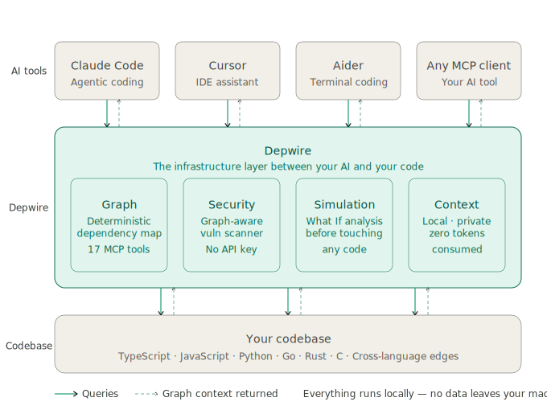

# Depwire

<div align="center">

[](https://www.npmjs.com/package/depwire-cli)
[](https://www.npmjs.com/package/depwire-cli)
[](https://registry.modelcontextprotocol.io/servers/io.github.atef-ataya/depwire)
[](https://glama.ai/mcp/servers/depwire/depwire)
[](LICENSE)
[](https://github.com/depwire/depwire/stargazers)

</div>

<div align="center">


</div>

**Your AI doesn't know your architecture. Depwire does.**

Depwire is the infrastructure layer between your AI coding assistant and your codebase. Before your AI touches a single file, Depwire has already mapped every connection, scored every risk, and simulated every change.


⭐ If Depwire saves you from a broken build, [star the repo](https://github.com/depwire/depwire) — it helps this project grow.

---

## The problem

AI coding tools are getting smarter. But they still have a fundamental blind spot: they don't know your architecture before they touch it.

You ask Claude to delete a utility file. It deletes it cleanly. Confident. No warnings.

Then you run the build. 30 files broken.

Claude had no idea. It saw one file. It didn't see the 30 downstream consumers.

This isn't a model problem. It's a context problem. The AI is flying blind.

---

## The infrastructure layer



Depwire is the context and safety layer for AI-generated code.

Depwire sits between your AI and your codebase. It builds a complete dependency graph using tree-sitter — deterministic, not probabilistic — and serves it to your AI through 17 MCP tools.

Four guarantees:

- **Local** — everything runs on your machine. No cloud parsing. No data sent anywhere.
- **Secure** — your code never leaves your machine. The security scanner requires no API key.
- **Token-efficient** — Depwire serves pre-computed graph data. Your AI gets surgical answers, not file dumps. 40% fewer tool calls. 56% fewer file reads.
- **Deterministic** — tree-sitter parses your code the same way every time. 100% accurate. Not a guess.

---

## Start here

```bash
npm install -g depwire-cli
```

Three commands to understand any codebase:

```bash
depwire whatif     # know what breaks before you change anything
depwire security   # catch vulnerabilities before AI ships them
depwire viz        # see your entire architecture instantly
```

---

## What If simulation

Know the blast radius before you touch anything.

```bash
depwire whatif . --simulate delete --target src/utils/encode.ts
```

Real output on [honojs/hono](https://github.com/honojs/hono) — 352 files, 6,245 symbols:

    Health Score:    41 → 41  (+0 → unchanged)
    Affected Nodes:  29
    Broken Imports:  30
    • src/utils/jwt/jwt.ts imports decodeBase64Url
    • src/adapter/aws-lambda/handler.ts imports encodeBase64
    • src/utils/basic-auth.ts imports decodeBase64
    [27 more...]
    Removed Edges:   32

Before touching a single file. Zero file I/O. Pure in-memory simulation.

Five operations:

```bash
depwire whatif . --simulate delete --target src/utils/encode.ts
depwire whatif . --simulate move --target src/utils/encode.ts --destination src/core/encode.ts
depwire whatif . --simulate rename --target src/utils/encode.ts --destination src/utils/encoder.ts
depwire whatif . --simulate split --target src/services/auth.ts --symbols "validateToken,refreshToken"
depwire whatif . --simulate merge --target src/utils/helpers.ts --merge-target src/utils/formatters.ts
```

Run without `--simulate` to open the browser UI — side-by-side arc diagrams showing current vs simulated state.

---

## Security scanner

AI will confidently ship vulnerable code. Depwire stops it before production.

```bash
depwire security .                        # full repo scan
depwire security . --target src/auth.ts   # single file
depwire security . --format sarif         # GitHub Security tab integration
depwire security . --fail-on high         # CI gate — exit 1 if HIGH or above
depwire security . --class injection      # specific check only
```

Real output on honojs/hono:

    6 Critical  19 High  14 Medium  1 Low

10 check categories — dependency CVEs, shell injection, hardcoded secrets, path traversal, auth bypass, input validation, information disclosure, cryptography weaknesses, frontend XSS, and architecture-level risks.

Graph-aware severity: a medium shell injection reachable from an MCP tool or HTTP route is automatically elevated to critical. This is what no generic SAST tool can replicate — Depwire knows your architecture, so it knows what's actually reachable.

Available as MCP tool `security_scan` and via `depwire-cli/sdk`.

---

## Visualization


```bash
depwire viz
```

Interactive arc diagram of your entire codebase. Every file, every connection, every dependency visible at once. Hover to inspect. Click to filter. Export as PNG or SVG.

---

## Temporal graph


```bash
depwire temporal
```

Watch your architecture evolve over git history. Timeline slider scrubs through commits — the arc diagram morphs as your codebase grew, coupled, and refactored. Nobody else does this.

---

## All commands

| Command | Description |
|---------|-------------|
| `depwire viz` | Interactive arc diagram in browser |
| `depwire whatif` | Simulate changes before touching code |
| `depwire security` | Scan for vulnerabilities — graph-aware severity |
| `depwire health` | 0-100 architecture health score across 6 dimensions |
| `depwire dead-code` | Find unused symbols with confidence scoring |
| `depwire docs` | Generate 13 architecture documents |
| `depwire temporal` | Visualize architecture evolution over git history |
| `depwire parse` | Parse and export dependency graph as JSON |
| `depwire mcp` | Start MCP server for AI coding assistants |

All commands auto-detect your project root. No path configuration needed.

---

## MCP server — AI integration

Connect Depwire to any MCP-compatible AI tool. Your AI gets 17 tools it can call autonomously.

**Claude Desktop** — add to `~/Library/Application Support/Claude/claude_desktop_config.json`:

```json
{
  "mcpServers": {
    "depwire": {
      "command": "npx",
      "args": ["-y", "depwire-cli", "mcp"]
    }
  }
}
```

**Cursor** — Settings → Features → Experimental → Enable MCP → Add Server:
- Command: `npx`
- Args: `-y depwire-cli mcp`


### 17 MCP tools

| Tool | Description |
|------|-------------|
| `connect_repo` | Connect to any local project or GitHub repo |
| `get_architecture_summary` | High-level project overview |
| `get_file_context` | Full context — imports, exports, dependents. Includes cross-language connections. |
| `get_dependencies` | What does a symbol depend on? |
| `get_dependents` | What depends on this symbol? |
| `get_symbol_info` | Look up any symbol's details |
| `search_symbols` | Find symbols by name across the codebase |
| `list_files` | List all files with stats |
| `impact_analysis` | What breaks if you change a symbol? Cross-language edges included. |
| `visualize_graph` | Generate interactive arc diagram |
| `get_health_score` | 0-100 health score with recommendations |
| `find_dead_code` | Symbols defined but never referenced |
| `get_project_docs` | Retrieve auto-generated codebase documentation |
| `update_project_docs` | Regenerate documentation on demand |
| `get_temporal_graph` | Architecture evolution over git history |
| `simulate_change` | Simulate move/delete/rename/split/merge before touching code. Returns health delta, broken imports, affected nodes. Cross-language edges included. |
| `security_scan` | Scan for vulnerabilities with graph-aware severity elevation. No API key required. |

---

## Cross-language edge detection

Depwire detects connections between files written in different languages.

A TypeScript `fetch('/api/users')` call matched to a Python `@app.get('/api/users')` route definition — that's a cross-language edge. Delete the Python route and Depwire shows the TypeScript callers as broken.

Supported patterns:
- REST API edges — fetch/axios calls matched to Express, FastAPI, Flask, Gin route definitions
- Subprocess edges — execSync/subprocess.run calls matched to target files in the graph

These edges flow through every existing feature: What If simulation, impact analysis, security scanner, and arc diagram visualization.

---

## Architecture health score

```bash
depwire health .
```

    Overall: 68/100 (Grade: D)
    Coupling              70   C
    Cohesion              80   B
    Circular Dependencies 100  A
    God Files             40   F
    Orphans & Dead Code   20   F
    Dependency Depth      60   D

6 dimensions. Letter grades. Actionable recommendations. Trend tracking across runs.

---

## SDK

Depwire exposes a stable public API for programmatic use and CI pipelines:

```bash
npm install depwire-cli
```

```typescript
import {
  parseProject,
  buildGraph,
  calculateHealthScore,
  analyzeDeadCode,
  generateDocs,
  scanSecurity,
  SimulationEngine,
  detectCrossLanguageEdges,
  searchSymbols,
  getImpact,
  getArchitectureSummary,
  DepwireSDKVersion
} from 'depwire-cli/sdk';
```

The SDK is the stable public API surface. All integrations should import from `depwire-cli/sdk` — never from internal paths.

---

## Why Depwire

| | Depwire | RAG-based tools | LLM scanning |
|--|---------|-----------------|--------------|
| Approach | Deterministic graph | Probabilistic match | Brute force |
| Accuracy | 100% — tree-sitter AST | ~70% — embedding match | Varies |
| Refactor safety | Full call chain tracing | Misses indirect refs | Blind edits |
| Token cost | Ultra-low — surgical reads | High — context stuffing | Extreme |
| Cross-language | REST + subprocess edges | None | None |
| Security scanner | Graph-aware severity | None | None |
| What If simulation | Before touching code | None | None |
| Runs locally | Always | Varies | Never |

---

## Language support

TypeScript, JavaScript, Python, Go, Rust, C, C#, Java, C++, Kotlin — with cross-language edge detection between all supported languages.

**Java / JVM** — classes, interfaces, enums, records, annotations, inner classes, anonymous classes, lambda expressions, Maven pom.xml and Gradle build file dependency edges, Spring Boot cross-language edges (@GetMapping, @PostMapping, @RequestMapping), JAX-RS / Jakarta EE route detection, Spring WebFlux RouterFunction support.

**C# / .NET** — classes, interfaces, records, structs, enums, delegates, file-scoped namespaces, primary constructors, global usings, .csproj ProjectReference and PackageReference edges, ASP.NET Core cross-language edges (attribute routing + Minimal API).

**C++ / Systems** — classes, structs, unions, enums, namespaces, concepts, coroutines, C++20 modules, template support with parameter stripping. CMakeLists.txt, Conan, and vcpkg dependency edge parsing. Crow, Drogon, Pistache, and cpp-httplib cross-language route detection. Dead code detection with vtable and template exclusions. Health score checks: circular includes, missing header guards, god classes, raw pointer fields, missing virtual destructors. Security scanner: buffer overflow, format string vulnerability, use-after-free, command injection.

**Kotlin / JVM** — classes, data classes, sealed classes, objects, companion objects, value classes, type aliases, extension functions, enum classes, annotation classes. Coroutine awareness: suspend functions, GlobalScope detection, structured concurrency checks. build.gradle.kts, build.gradle, and settings.gradle.kts dependency parsing. Spring Boot, Ktor, Http4k, and Ktor Resources cross-language route detection. Android Retrofit outgoing edge detection. Dead code detection with Android lifecycle and Spring annotation exclusions. Security scanner: SQL injection via string templates, hardcoded credentials, insecure random, not-null assertion abuse, Ktor missing auth blocks.

---

## GitHub Action — PR Impact Analysis

Depwire integrates into your CI/CD pipeline via the [depwire-action](https://github.com/depwire/depwire-action) GitHub Action.

On every pull request it automatically posts a dependency impact report — which symbols changed, what breaks, health score before and after. Code reviewers see the architectural blast radius before merging.

Add to `.github/workflows/depwire.yml`:

```yaml
name: Depwire PR Impact
on:
  pull_request:
    branches: [main]

permissions:
  contents: read
  pull-requests: write

jobs:
  depwire:
    runs-on: ubuntu-latest
    steps:
      - uses: actions/checkout@v4
        with:
          fetch-depth: 0
      - uses: actions/setup-node@v4
        with:
          node-version: '20'
      - uses: depwire/depwire-action@v1
        with:
          github-token: ${{ secrets.GITHUB_TOKEN }}
```

Block PRs that hurt your architecture:

```yaml
- uses: depwire/depwire-action@v1
  with:
    github-token: ${{ secrets.GITHUB_TOKEN }}
    fail-on-score-drop: 5
```

[GitHub Marketplace](https://github.com/marketplace/actions/depwire-pr-impact) — [depwire-action repo](https://github.com/depwire/depwire-action)

---

## Cloud dashboard

[app.depwire.dev](https://app.depwire.dev) — full dependency graph, health score, dead code report, and AI codebase chat in the browser. No local setup required.

- Free for public repos
- Pro ($19/month) — unlimited repos, private repo support, AI codebase chat

---

## Roadmap

**Shipped**
- Arc diagram visualization
- 17 MCP tools
- Multi-language support (TypeScript, JavaScript, Python, Go, Rust, C, C#, Java, C++, Kotlin)
- Architecture health score
- Dead code detection
- Temporal graph
- What If simulation — CLI + browser UI
- Security scanner — graph-aware severity elevation
- Cross-language edge detection — REST API + subprocess
- Public SDK — `depwire-cli/sdk`
- Cloud dashboard — app.depwire.dev
- PR Impact GitHub Action

**Coming next**
- AI-suggested refactors
- VSCode extension
- Natural language architecture queries

---

## Security posture

Depwire is read-only. It never writes to, modifies, or executes your code.

- Parses with tree-sitter — the same parser used by VS Code and Zed
- Visualization server binds to localhost only
- No data leaves your machine
- Blocks access to sensitive system directories
- npm packages published with provenance verification

See [SECURITY.md](SECURITY.md) for full details.

---

## Contributing

1. Fork the repository
2. Create a feature branch
3. Add tests for new functionality
4. Submit a pull request
5. Sign the CLA (handled automatically on your first PR)

---

## Author

**Atef Ataya** — AI architect, author, and creator of Depwire.

- [YouTube](https://www.youtube.com/@atefataya) — 600K+ subscribers covering AI agents, MCP, and LLMs
- [The Architect's Playbook: 5 Pillars](https://www.amazon.com/dp/B0GCHNW2W8)
- [LinkedIn](https://www.linkedin.com/in/atefataya/)

---

## License

[Business Source License 1.1](LICENSE) — free for personal and internal company use. Converts to Apache 2.0 on February 25, 2029.

Commercial licensing: atef@depwire.dev

---

Built with [tree-sitter](https://tree-sitter.github.io/tree-sitter/), [graphology](https://graphology.github.io/), [D3.js](https://d3js.org/), and the [Model Context Protocol](https://modelcontextprotocol.io/).
